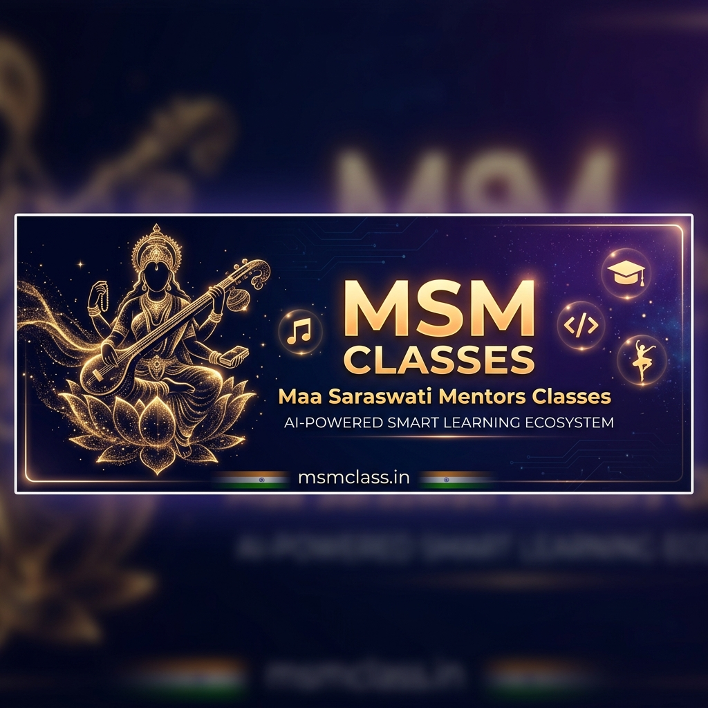
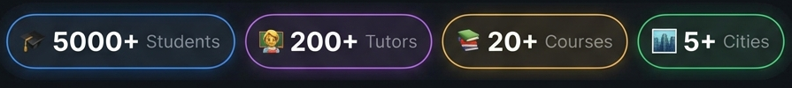

<!-- ═══════════════════════════════════════════════════════════ -->
<!--              MSM CLASSES — GitHub Organization Profile              -->
<!-- ═══════════════════════════════════════════════════════════ -->

<div align="center">

<!-- BANNER: Replace with your official banner from /images/banner.png or CDN -->


<br/>

<!-- Animated typing headline -->
[](https://git.io/typing-svg)

<br/>

<!-- Shield badges row 1 -->
[](https://msmclass.in)
[](https://msmclass.in/samvaad)
[](https://msmclass.in/courses)
[](https://msmclass.in/signup)

<br/><br/>

<!-- Social / Contact -->
[](mailto:contact@msmclass.in)
[](https://maps.google.com)
[](https://msmclass.in/about)

</div>

---

## 🎯 About MSM Classes

> **Maa Saraswati Mentors Classes (MSM Classes)** is Bharat's emerging AI-powered education platform — merging traditional mentorship values with cutting-edge technology to transform how students learn academics, coding, music, and dance.

Founded in **2017** and digitally supercharged since **2021**, we operate on a mission to make **world-class learning accessible** to every student across India — from home tuition in Ghaziabad to live online classrooms reaching every city.

We don't just teach — we **transform** lives.

---

## 🌟 What We Offer

<table>
<tr>
<td width="50%" valign="top">

### 🎓 Academic Tuition
- **CBSE / ICSE / Foundation** curriculum coverage
- Classes **up to Class 8** (Science, Maths, English, Hindi, GK, SST)
- Background-verified, certified expert tutors
- Home Tuition | Live Online | Recorded | Offline Centers

</td>
<td width="50%" valign="top">

### 💻 Computer & Coding
- **Web Development** (HTML, CSS, JavaScript — 3 Months)
- Programming fundamentals & project-based learning
- Industry-relevant skill-building tracks
- AI & emerging tech modules *(coming soon)*

</td>
</tr>
<tr>
<td width="50%" valign="top">

### 🎵 Music & Arts
- **Piano / Classical Vocal / Western / Hindustani**
- Structured certification programs
- Taught by Anjali Sharma (Piano & Vocal specialist)
- Beginner → Advanced learning paths

</td>
<td width="50%" valign="top">

### 💃 Dance & Fitness
- **Classical Dance** forms
- **Zumba Fitness** (shift-wise batches)
- Energetic, well-guided sessions
- Flexible scheduling for all age groups

</td>
</tr>
</table>

---

## 🤖 AI-Powered Learning Platform

Our **proprietary AI engine** powers every step of your learning journey:

```
📋 Enroll & Assess  →  🧠 AI Skill Mapping  →  👩‍🏫 Tutor Assigned
      ↑                                                    ↓
🏆 Certification   ←   📊 Assessments      ←   🖥️ Live + Recorded Sessions
```

| Feature | Description |
|---|---|
| 🔍 **Smart Assessment** | AI evaluates your current skill level on enrollment |
| 🗺️ **Adaptive Learning Path** | Personalized curriculum tailored to your pace |
| 📈 **Real-Time Progress Tracking** | Live analytics for students and parents |
| 🎯 **Adaptive Difficulty** | Lessons that grow with you |
| 📊 **Progress Reports** | Transparent, regular updates for parents |

---

## 📹 Samvaad — 100% Indian Video Platform

<div align="center">

[](https://msmclass.in/samvaad)

</div>

> **Samvaad** is MSM's **homegrown, end-to-end encrypted** meeting platform — built in India, for India.

- 🔒 **End-to-End Encrypted** — Zero data leaks, ever
- 🇮🇳 **100% Data Sovereignty** — Your data stays in India
- ⚡ **Zero Limitations** — No time caps, no participant limits
- 💸 **Free of Cost** — Always and forever for learners
- 🛡️ **Safe & Monitored** — Especially designed for students

---

## 📊 Our Impact

<div align="center">

<!-- Stats image placeholder — replace with live stats widget or your image -->


</div>

<div align="center">

| 🎓 Students | 👩‍🏫 Tutors | 📚 Courses | 🏙️ Cities |
|:---:|:---:|:---:|:---:|
| **5,000+** | **200+** | **20+** | **5+** |

</div>

---

## 🏆 Learning Modes

<div align="center">

| 🏠 Home Tuition | 💻 Live Online | 🎬 Recorded Lessons | 🏫 Offline Centers |
|:---:|:---:|:---:|:---:|
| Expert tutors at your door | Real-time interactive classes | Learn at your own pace | Physical learning centers |

</div>

---

## 💬 What Our Students Say

> *"MSM Classes transformed my child's confidence and academic performance."*
> — **Ritika Sharma**, Parent – Class 6

> *"Professional tutors and structured learning. Highly recommended!"*
> — **Aman Verma**, Piano Student

> *"The online dance sessions are energetic and well guided."*
> — **Sneha Gupta**, Dance Student

---

## 🛠️ Tech Stack (Building Bharat's EdTech)

<!-- TODO: Replace placeholder badges with your actual stack once confirmed -->

<div align="center">

**Frontend**


**Backend & AI**


**Communication (Samvaad)**


**Cloud & DevOps**


</div>

---

## 📁 Organization Repositories

> 🚧 *Repositories are being set up. Watch this space!*

| Repository | Description | Status |
|---|---|:---:|
| `samvaad` | 🎥 100% Indian encrypted video conferencing platform | 🟢 Active |
| `msm-web` | 🌐 Main website & student portal (msmclass.in) | 🔄 In Progress |
| `msm-ai-engine` | 🤖 Adaptive learning AI & skill assessment engine | 🔄 In Progress |
| `msm-app` | 📱 Student mobile app (Android & iOS) | 🟡 Planned |
| `msm-lms` | 📚 Learning Management System & course CMS | 🟡 Planned |
| `msm-ci-cd` | ⚙️ Pushpaka CI/CD pipeline & DevOps configs | 🟢 Active |

---

## 🤝 Get Involved

<div align="center">

### 🌱 We're Growing — Join the Mission!

| For Students | For Tutors | For Developers | For Parents |
|:---:|:---:|:---:|:---:|
| [Enroll Now](https://msmclass.in/signup) | [Become a Tutor](https://msmclass.in/contact) | [Contribute](https://github.com/msmclass) | [Know More](https://msmclass.in/about) |

</div>

---

## 📞 Connect With Us

<div align="center">

[](https://msmclass.in)
[](mailto:contact@msmclass.in)

[](https://linkedin.com/company/msmclass)
[](https://instagram.com/msmclasses)
[](https://youtube.com/@msmclasses)

<br/>

📍 **Aditya Urban Homes, Aditya World City, Bamheta, Ghaziabad, UP — 201002**

</div>

---

<div align="center">

<!-- Activity/contribution graph — replace org name when GitHub org is set up -->
<!--  -->

<br/>

**"Empowering Bharat, One Student at a Time"** 🇮🇳

<sub>© 2017–2026 Maa Saraswati Mentors Classes (MSM Classes). All rights reserved.</sub>

<br/>

<!-- Visitor counter — replace msmclass with your actual GitHub org username -->


</div>
